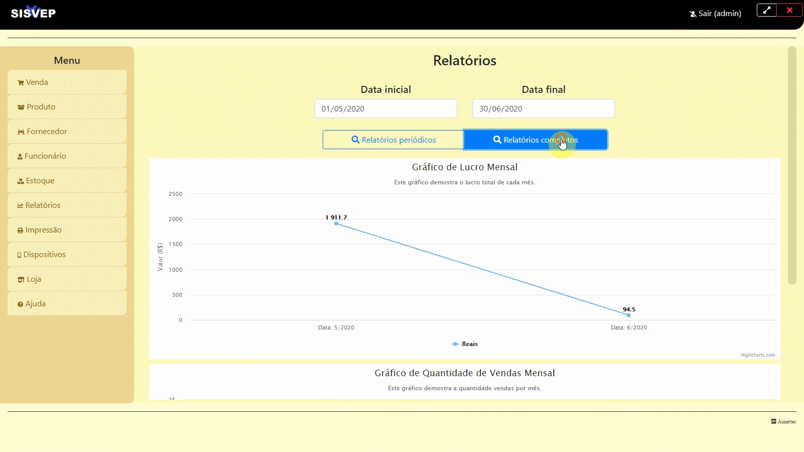

<h1 align="center" >
    
</h1>

<h3 align="center">
  Sistema de gerênciamento de vendas em pequenos mercados
</h3>

<p align="center">
  <a href="#dart-projeto">Projeto</a>&nbsp;&nbsp;&nbsp;|&nbsp;&nbsp;&nbsp;
  <a href="#mag-tecnologias">Tecnologias</a>&nbsp;&nbsp;&nbsp;|&nbsp;&nbsp;&nbsp;
    <a href="#information_source-como-usar">Como Usar</a>&nbsp;&nbsp;&nbsp;|&nbsp;&nbsp;&nbsp;
  <a href="#memo-licença">Licença</a>
</p>


<p align="center">
  
  
</p>    

<p align="flex-start" style="flex-direction:row">
  
  
</p>  

## :dart: Projeto
  O Sisvep é um software que visa facilitar o processo de venda em pequenas lojas, provendo funcionalidades para cadastro, busca, controle de estoque entre outras.
  O sistema posibilita ler o código de barras de um produto pelo app mobile e em tempo real adicionar esse produto a uma venda no app desktop, tornado o processo mais simples e escalavél.
  Com cada venda realizada são feitos relatórios com gráficos que possibilitam o usuário saber qual mês teve mais lucro, mais vendas, produtos mais vendidos, produtos que geram mais lucro entre outros.


## :mag: Tecnologias
-  [Node](https://nodejs.org/en/)
-  [Electron](https://www.electronjs.org/)
-  [Expo](https://expo.io/)
-  [React-Native](https://facebook.github.io/react-native/)

## :information_source: Como Usar
Para testar o projeto, você vai precisar: [Git](https://git-scm.com), [Node.js v10.16](https://nodejs.org/en/) ou maior, [Yarn](https://yarnpkg.com/) ou [Npm](https://www.npmjs.com/), [Expo sdk37 ](https://expo.io/) , [Electron v9.0.0](https://www.electronjs.org/) + [MongoDB v4.2](https://docs.mongodb.com/manual/)  instalados no seu computador. Na linha de comando:

```bash
# Clone o repositório
$ git clone https://github.com/ainertec-developer/sisvep sisvep

# Entre no repositório
$ cd sisvep

# Entre na no diretório backend
$ cd backend

# Instale as dependências
$ yarn 
# ou
$ npm i

# Inicie o servidor mongo
$ mongod

# Inicie o backend
$ yarn start
# ou
$ npm start

# Entre no diretório mobile
$ cd sisvep/mobile

# Instale as dependências
$ yarn 

# Inicie o app
$ yarn start

# Vá para o diretório frontend
$ cd sisvep/frontend

# Instale as dependências
$ yarn 
```

## :memo: Licença
Para informações sobre [LICENÇA](https://github.com/ainertec-developer/sisvep/blob/master/license.txt)

---
Feito com :heart: por Ainertec

